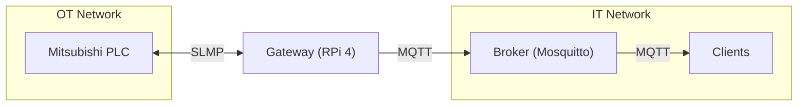
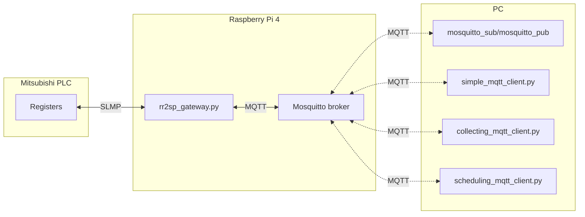

<a id="readme-top"></a>

<!-- PROJECT SHIELDS -->
[![Contributors][contributors-shield]][contributors-url]
[![Forks][forks-shield]][forks-url]
[![Stargazers][stars-shield]][stars-url]
[![Issues][issues-shield]][issues-url]
[![MIT][license-shield]][license-url]

<!-- PROJECT LOGO -->
<br />
<div align="center">
<h3 align="center">Request-Response to Subscriber-Publisher Gateway</h3>
  <p align="center">
    Gateway for IT/OT separation allowing dynamic reconfiguration of the polling
    process and translation of Request-Response protocols to Subscriber-Publisher ones.
    <br />
    <a href="https://github.com/patryk-chaber/rr2spgateway/issues/new?labels=bug&template=bug-report---.md">Report Bug</a>
    &middot;
    <a href="https://github.com/patryk-chaber/rr2spgateway/issues/new?labels=enhancement&template=feature-request---.md">Request Feature</a>
  </p>
</div>

<!-- TABLE OF CONTENTS -->
<details>
  <summary>Table of Contents</summary>
  <ol>
    <li>
      <a href="#about-the-project">About The Project</a>
      <ul>
        <li><a href="#repository-structure">Repository Structure</a></li>
      </ul>
    </li>
    <li>
      <a href="#getting-started">Getting Started</a>
      <ul>
        <li><a href="#prerequisites">Prerequisites</a></li>
        <li><a href="#installation">Installation</a></li>
        <li><a href="#broker-setup">Broker Setup</a></li>
      </ul>
    </li>
    <li>
      <a href="#configuration">Configuration</a>
      <ul>
        <li><a href="#scanlistcsv">scan_list.csv</a></li>
        <li><a href="#generate_scan_listpy">generate_scan_list.py</a></li>
        <li><a href="#configyaml">config.yaml</a></li>
        <li><a href="#cli-arguments">CLI Arguments</a></li>
      </ul>
    </li>
    <li>
      <a href="#usage">Usage</a>
      <ul>
        <li><a href="#basic-example">Basic Example</a></li>
        <li><a href="#example-clients">Example Clients</a></li>
        <li><a href="#situation-aware-scheduling">Situation-Aware Scheduling</a></li>
      </ul>
    </li>
    <li>
      <a href="#experiments">Experiments</a>
      <ul>
        <li><a href="#run_experimentssh">run_experiments.sh</a></li>
        <li><a href="#run_experiments_mqttsh">run_experiments_mqtt.sh</a></li>
        <li><a href="#run_many_experimentssh">run_many_experiments.sh</a></li>
      </ul>
    </li>
    <li>
      <a href="#mqtt-interface">MQTT Interface</a>
      <ul>
        <li><a href="#published-topics">Published Topics</a></li>
        <li><a href="#command-topic">Command Topic</a></li>
      </ul>
    </li>
    <li><a href="#roadmap">Roadmap</a></li>
    <li><a href="#contributing">Contributing</a></li>
    <li><a href="#license">License</a></li>
    <li><a href="#contact">Contact</a></li>
    <li><a href="#acknowledgments">Acknowledgments</a></li>
  </ol>
</details>

<!-- ABOUT THE PROJECT -->
## About The Project

This gateway bridges SLMP -- a legacy Request-Response protocol used in
Mitsubishi PLCs and OT networks -- with MQTT, a Subscriber-Publisher
protocol common in IT infrastructure. By acting as the sole intermediary
between the PLC and IT clients, it enforces IT/OT network separation and
limits direct access to PLC registers from the IT side. Unlike static gateway
implementations, the polling schedule can be reconfigured at runtime, allowing
data collection frequency to adapt to the current state of the monitored process.

This project accompanies the paper: *Dynamic SLMP-to-MQTT Protocol Gateway for
Secure Industrial IoT Data Distribution* (IEEE Access, under review).



### Repository Structure

| File | Description |
|---|---|
| `rr2sp_gateway.py` | Main gateway process — polls the PLC over SLMP and publishes register values to MQTT |
| `scan_list.py` | `RegisterScanner` and `RegisterScanEntry` classes; manages the dynamic scan list loaded from CSV |
| `slmp.py` | SLMP 3E frame builder and parser for Mitsubishi PLCs |
| `config_loader.py` | YAML configuration loader; defines the dataclass config tree and `load()` / `validate()` / `pretty()` helpers |
| `config.yaml` | Default runtime configuration (PLC IP, MQTT broker, scan list path, timing parameters) |
| `generate_scan_list.py` | CLI tool to generate a `scan_list.csv` from a start address and register count |
| `scan_list.csv` | Active scan list — defines which PLC registers to poll, at what rate, and with what type |
| `simple_mqtt_client.py` | Minimal MQTT subscriber that logs incoming register values to the console |
| `collecting_mqtt_client.py` | MQTT subscriber that appends received register values to a timestamped CSV file |
| `scheduling_mqtt_client.py` | MQTT client that monitors register thresholds and adjusts the gateway's scan schedule via commands |
| `plc_write.py` | CLI utility to write a single word register on the PLC over SLMP (used in `simulate_control_states.sh`) |
| `mock_plc.py` | Simulated SLMP server for testing without physical hardware |
| `simulate_control_states.sh` | Injects a sequence of register state transitions into the PLC (or mock) to simulate process changes |
| `run_experiments.sh` | Experiment runner for the topology: 1 PLC → N gateways → 0 MQTT clients |
| `run_experiments_mqtt.sh` | Experiment runner for the topology: 1 PLC → 1 gateway → N MQTT clients |
| `run_many_experiments.sh` | Sweeps both experiment topologies across varying scan list sizes and instance counts |
| `pyproject.toml` | Python package metadata and editable-install configuration |
| `README.md` | Project documentation |
| `LICENSE.txt` | MIT licence text |

<p align="right">(<a href="#readme-top">back to top</a>)</p>

<!-- GETTING STARTED -->
## Getting Started

Tested hardware:
- **PLC**: Mitsubishi FX5U-32MT/ESS (or any Mitsubishi device supporting SLMP 3E frames)
- **Gateway host**: Raspberry Pi 4 Model B Rev 1.5

Network requirements:
- The gateway host must be able to reach the PLC on its configured SLMP port (default: 30000)
- The gateway host must be able to reach the MQTT broker (default: localhost:1883)

### Prerequisites

* Python 3.10+
* paho-mqtt 2.0+
* PyYAML
* An MQTT broker accessible on the network (tested with Mosquitto)

### Installation

1. Clone the repo
   ```sh
   git clone https://github.com/patryk-chaber/rr2spgateway.git
   cd rr2spgateway
   ```
2. Create and activate a virtual environment, then install the package and its dependencies
   ```sh
   python -m venv .
   source bin/activate
   pip install -e .
   ```
3. Prepare `scan_list.csv` -- see [Configuration](#configuration)
4. Adjust `config.yaml` to match your PLC IP, MQTT broker address, and credentials

### Broker Setup

A reference Mosquitto configuration is provided in [`mosquitto_configuration/`](mosquitto_configuration/).
It enables authentication and topic-level access control. To use it:

1. Install Mosquitto
   ```sh
   sudo apt install mosquitto mosquitto-clients
   ```
2. Copy the configuration and ACL files
   ```sh
   sudo cp mosquitto_configuration/mosquitto.conf /etc/mosquitto/mosquitto.conf
   sudo cp mosquitto_configuration/acl /etc/mosquitto/acl
   ```
3. Create the password file and add users
   ```sh
   sudo mosquitto_passwd -c /etc/mosquitto/passwd admin_user
   sudo mosquitto_passwd /etc/mosquitto/passwd gateway_user
   sudo mosquitto_passwd /etc/mosquitto/passwd basic_user
   sudo mosquitto_passwd /etc/mosquitto/passwd scheduler_user
   ```
   The `-c` flag creates a new file; omit it for subsequent users to avoid overwriting.

4. Restart Mosquitto
   ```sh
   sudo systemctl restart mosquitto
   ```

The ACL file defines three user roles:

| User | Access |
|---|---|
| `admin_user` | Read/write on all topics |
| `gateway_user` | Write to `gateway/separate/#`, `gateway/status/#`; read from `gateway/command` |
| `basic_user` | Read from `gateway/separate/#`, `gateway/status/#` |
| `scheduler_user` | Read from `gateway/separate/#`, `gateway/status/#`; write to `gateway/command` |

> [!NOTE]
> The topic prefixes in the ACL (`gateway/separate/`, `gateway/status/`, `gateway/command`)
> are derived from the `output.mqtt.prefix` set in `config.yaml`. Update both files
> together if you change the prefix.

<p align="right">(<a href="#readme-top">back to top</a>)</p>

<!-- CONFIGURATION -->
## Configuration

### scan_list.csv

A CSV file defining which PLC registers to poll. Requires a header row with
four columns (names only need to start with the indicated letter, case-insensitive):

| Column | Starts with | Description |
|--------|-------------|-------------|
| Start  | `s`         | Starting register address (e.g. `D100`, `SD519`) |
| Length | `l`         | Number of consecutive registers to read |
| Type   | `t`         | Register type: `BIT`, `WORD`, `UWORD`, `DWORD`, `FLOAT` |
| Period | `p`         | Polling period in milliseconds (0 = disabled) |

Example:
```csv
start, length, type, period
D100,  10,     WORD, 1000
SD519, 1,      WORD, 500
```

Use `generate_scan_list.py` to generate this file automatically -- see [generate_scan_list.py](#generate_scan_listpy) below.

### generate_scan_list.py

```
python generate_scan_list.py START COUNT [options]
```

| Argument | Default | Description |
|---|---|---|
| `START` | *(required)* | Starting register address, e.g. `D100` or `SD518` |
| `COUNT` | *(required)* | Number of registers to include |
| `--mode {block,separate}` | `block` | `block`: one multi-register read request; `separate`: one request per register |
| `--type REG_TYPE` | inferred | Register type: `BIT`, `WORD`, `UWORD`, `DWORD`, `FLOAT` (inferred from device prefix if omitted) |
| `--period PERIOD` | `1` | Polling period in milliseconds |
| `--output OUTPUT` | `scan_list.csv` | Output CSV file path |

Examples:

```sh
# One block request for 10 registers starting at SD518, polled every 100 ms
python generate_scan_list.py SD518 10 --mode block --period 100

# Ten separate 1-register requests for D100..D109, polled every 1 ms
python generate_scan_list.py D100 10 --mode separate --period 1

# Write to a custom file
python generate_scan_list.py D100 5 --output my_scan_list.csv
```

### config.yaml

All runtime parameters are controlled through a YAML configuration file.
A minimal example (unspecified keys fall back to defaults):

```yaml
input:
  type: slmp
  slmp:
    ip: 192.168.200.99   # PLC IP address
    port: 30000           # SLMP TCP port

output:
  type: mqtt
  mqtt:
    ip: localhost         # MQTT broker IP
    port: 1883
    username: gateway_user  # placeholder — change before non-isolated deployment
    password: gateway       # placeholder — change before non-isolated deployment
    prefix: gateway       # All topics published under this prefix

gateway:
  scan_list: scan_list.csv
  status_refresh_ms: 100  # How often timing statistics are published
  stats_refresh_ms: 60000 # How often register-level statistics are published

logging:
  level: INFO
```

> [!WARNING]
> The `username` and `password` values above are placeholders. Change them in
> `config.yaml` and in any client script before deploying outside an isolated
> lab network.

### CLI Arguments

`rr2sp_gateway.py` accepts two optional command-line arguments:

| Argument | Default | Description |
|---|---|---|
| `config` | `config.yaml` | Path to the YAML configuration file |
| `--log-level` | from config | Override the logging level (`DEBUG`, `INFO`, `WARNING`, `ERROR`, `CRITICAL`) |

<p align="right">(<a href="#readme-top">back to top</a>)</p>

<!-- USAGE -->
## Usage

The diagram below shows all components involved in the full setup and which
machine each one runs on.



### Basic Example

The following example assumes a single machine running both the gateway and the
MQTT broker, connected to a PLC over the network.

**1. Start the MQTT broker**
```sh
mosquitto -c /etc/mosquitto/mosquitto.conf
```

**2. Start the gateway**
```sh
source bin/activate
python rr2sp_gateway.py config.yaml --log-level INFO
```

**3. Subscribe to register values** (using any MQTT client, e.g. `mosquitto_sub`)
```sh
mosquitto_sub -h localhost -t "gateway/separate/#" -u basic_user -P basic
```

Published messages have the following JSON format:
```json
{"value": 1234, "timestamp": "2026-05-15T10:30:00.123456"}
```

**4. Modify the scan list at runtime** (send a command via MQTT)
```sh
mosquitto_pub -h localhost -t "gateway/command" -u scheduler_user -P scheduler \
  -m '{"command": "append", "start": "D200", "length": 5, "type": "WORD", "period": 500}'
```

### Example Clients

Two lightweight client scripts are provided for subscribing to register data.

#### simple_mqtt_client.py

Connects to the broker, subscribes to a configurable topic filter, and logs each
arriving JSON payload to the console. Useful for quick inspection or debugging.

```
python simple_mqtt_client.py <mqttip> [options]
```

| Argument | Default | Description |
|---|---|---|
| `mqttip` | *(required)* | MQTT broker address |
| `--mqttport PORT` | `1883` | Broker port |
| `--mqttuser USER` | `basic_user` | Username |
| `--mqttpass PASS` | `basic` | Password |
| `--mqttname NAME` | `Node` | MQTT client ID |
| `--mqtttopic TOPIC` | `topic` | Topic filter to subscribe to |

```sh
# Subscribe to all register values published under the gateway prefix
python simple_mqtt_client.py localhost --mqtttopic "gateway/separate/#"
```

#### collecting_mqtt_client.py

Subscribes to a fixed set of MQTT topics and appends every received value to a
timestamped CSV file (`YYYYMMDD_HHMMSS_data.csv`). Intended for automated data
collection during experiments. The list of monitored topics is defined as a
module-level constant in the script.

```
python collecting_mqtt_client.py <mqttip> [options]
```

| Argument | Default | Description |
|---|---|---|
| `mqttip` | *(required)* | MQTT broker address |
| `--mqttport PORT` | `1883` | Broker port |
| `--mqttuser USER` | `basic_user` | Username |
| `--mqttpass PASS` | `basic` | Password |
| `--mqttname NAME` | `Collector` | MQTT client ID |

```sh
python collecting_mqtt_client.py localhost
```

### Situation-Aware Scheduling

`scheduling_mqtt_client.py` implements adaptive polling by monitoring PLC register
values over MQTT and adjusting the gateway's scan schedule based on the current
process state.

It is built around three classes:

- **`RegisterMonitor`** -- subscribes to a single register topic, classifies
  incoming values against a list of thresholds into named bands
  (e.g. `LL`, `L`, `N`, `H`, `HH`), and fires callbacks on state transitions.
- **`Scheduler`** -- aggregates multiple `RegisterMonitor` instances and publishes
  SLMP commands to the gateway's command topic when *all* monitors reach the same
  band simultaneously.
- **`Command`** -- maps a band label to a JSON command string.

This enables, for example, automatically slowing down polling when a register is
in the normal range and speeding it up as it approaches a critical threshold --
without any changes to the PLC program.

```
python scheduling_mqtt_client.py <mqttip> [options]
```

| Argument | Default | Description |
|---|---|---|
| `mqttip` | *(required)* | MQTT broker address |
| `--mqttport PORT` | `1883` | Broker port |
| `--mqttuser USER` | `scheduler_user` | Username |
| `--mqttpass PASS` | `scheduler` | Password |
| `--mqttname NAME` | `Node` | MQTT client ID |
| `--mqttprefix PREFIX` | `gateway` | Topic prefix matching the gateway's `output.mqtt.prefix` |

The `__main__` block contains a working example: it monitors register `D100` with
thresholds `[2400, 2500, 4500, 5500]` and adjusts its polling period to `1500 ms`
(`HH`), `15000 ms` (`H`), or `150000 ms` (`N`). Adapt the register name, thresholds,
and commands to match your process.

<p align="right">(<a href="#readme-top">back to top</a>)</p>

<!-- EXPERIMENTS -->
## Experiments

The repository includes three bash scripts for running repeatable performance
experiments. Each script captures SLMP and MQTT traffic with `tcpdump`, writes
per-process logs, and prints a packet capture summary on exit.

### run_experiments.sh

**Topology:** 1 PLC → N gateways → 0 MQTT clients

Launches N independent instances of `rr2sp_gateway.py`, each listening on a
separate port (`BASE_PORT`, `BASE_PORT+1`, …) and publishing to its own MQTT
prefix (`gateway_1`, `gateway_2`, …). Used to measure how gateway performance
scales with the number of concurrent polling processes.

```
./run_experiments.sh <N> <duration_s> <plc_ip> <mqtt_ip> <base_port> [plc_iface] [mqtt_iface]
```

| Argument | Default | Description |
|---|---|---|
| `N` | `1` | Number of gateway instances |
| `duration_s` | `60` | Experiment duration in seconds |
| `plc_ip` | `192.168.1.10` | PLC IP address |
| `mqtt_ip` | `127.0.0.1` | MQTT broker IP |
| `base_port` | `30000` | First SLMP port; each instance uses `base_port + i - 1` |
| `plc_iface` | `enxc8a362c01365` | Network interface for SLMP tcpdump capture |
| `mqtt_iface` | `lo` | Network interface for MQTT tcpdump capture |

Logs and pcap files are written to `logs/<timestamp>_N<N>_dur<duration>/`.

### run_experiments_mqtt.sh

**Topology:** 1 PLC → 1 gateway → N MQTT clients

Launches a single `rr2sp_gateway.py` instance and N instances of
`simple_mqtt_client.py`, each subscribing to a different register. Used to
measure how the gateway performs under increasing numbers of simultaneous
MQTT subscribers.

```
./run_experiments_mqtt.sh <N> <duration_s> <plc_ip> <mqtt_ip> <base_port> <register_diff> [plc_iface] [mqtt_iface]
```

| Argument | Default | Description |
|---|---|---|
| `N` | `1` | Number of MQTT client instances |
| `duration_s` | `60` | Experiment duration in seconds |
| `plc_ip` | `192.168.1.10` | PLC IP address |
| `mqtt_ip` | `127.0.0.1` | MQTT broker IP |
| `base_port` | `30000` | SLMP port for the gateway |
| `register_diff` | `0` | Register offset between consecutive clients (0 = all subscribe to the same register) |
| `plc_iface` | `enxc8a362c01365` | Network interface for SLMP tcpdump capture |
| `mqtt_iface` | `lo` | Network interface for MQTT tcpdump capture |

Logs and pcap files are written to `mqtt_logs/<timestamp>_N<N>_dur<duration>/`.

### run_many_experiments.sh

Sweeps both topologies across multiple scan list sizes and values of N by
calling `run_experiments.sh` and `run_experiments_mqtt.sh` in sequence. Scan
lists are regenerated before each sweep using `generate_scan_list.py`.

```
./run_many_experiments.sh [plc_ip] [local_ip] [experiment_time_s] [max_n] [start_device]
```

| Argument | Default | Description |
|---|---|---|
| `plc_ip` | `192.168.200.99` | PLC IP address |
| `local_ip` | `127.0.0.1` | Local IP for MQTT broker |
| `experiment_time_s` | `60` | Duration of each individual experiment |
| `max_n` | `6` | Maximum number of instances (N sweeps from 1 to max_n) |
| `start_device` | `SD518` | Starting register address for scan list generation |

<p align="right">(<a href="#readme-top">back to top</a>)</p>

<!-- MQTT INTERFACE -->
## MQTT Interface

All topics are published under the prefix defined in `config.yaml` (default: `gateway`).

### Published Topics

| Topic | Description | Format |
|---|---|---|
| `<prefix>/separate/<register>` | Current value of a single register | `{"value": ..., "timestamp": "..."}` |
| `<prefix>/status` | Per-cycle timing statistics | JSON with `mean`, `rel_mean`, `total_mean`, `cycles` |
| `<prefix>/status/registers` | Current scan list (published on change) | JSON array of `{start, length, type, period}` |
| `<prefix>/status/stats` | Per-register communication statistics | JSON array of per-entry stats |

### Command Topic

Publish JSON to `<prefix>/command` to modify the scan list at runtime.

| Field | Description |
|---|---|
| `command` | One of: `append`, `remove`, `modify`, `poll`, `list`, `stats` |
| `start` | Register start address (e.g. `"D100"`) |
| `length` | Number of registers |
| `type` | Register type: `BIT`, `WORD`, `UWORD`, `DWORD`, `FLOAT` |
| `period` | Scan period in milliseconds |

Command reference:

| Command | Required | Optional | Effect |
|---|---|---|---|
| `append` | `start`, `length`, `type`, `period` | -- | Add a new register range to the scan list |
| `remove` | `start` | `length`, `type`, `period` | Remove the matching entry |
| `modify` | `start` | `length`, `type`, `period` | Update parameters of an existing entry |
| `poll`   | `start` | `length`, `type`, `period` | Trigger an immediate one-off scan |
| `list`   | -- | -- | Publish the current scan list to `status/registers` |
| `stats`  | -- | -- | Publish per-register statistics to `status/stats` |

<p align="right">(<a href="#readme-top">back to top</a>)</p>

<!-- ROADMAP -->
## Roadmap

**Hardware tested:**
- Mitsubishi FX5U-32MT/ESS
- Raspberry Pi 4 Model B Rev 1.5

**Planned:**
- [ ] Modbus TCP input support
- [ ] SparkplugB output encoding
- [ ] Parallel (multiprocess) scanning for high-frequency workloads

See the [open issues](https://github.com/patryk-chaber/rr2spgateway/issues) for
a full list of proposed features and known issues.

<p align="right">(<a href="#readme-top">back to top</a>)</p>

<!-- CONTRIBUTING -->
## Contributing

Contributions are what make the open source community such an amazing place to
learn, inspire, and create. Any contributions you make are **greatly appreciated**.

If you have a suggestion that would make this better, please fork the repo and
create a pull request. You can also simply open an issue with the tag "enhancement".

1. Fork the Project
2. Create your Feature Branch (`git checkout -b feature/AmazingFeature`)
3. Commit your Changes (`git commit -m 'Add some AmazingFeature'`)
4. Push to the Branch (`git push origin feature/AmazingFeature`)
5. Open a Pull Request

<p align="right">(<a href="#readme-top">back to top</a>)</p>

<!-- LICENSE -->
## License

Distributed under the MIT License. See `LICENSE.txt` for more information.

<p align="right">(<a href="#readme-top">back to top</a>)</p>

<!-- CONTACT -->
## Contact

Patryk Chaber - patryk.chaber@pw.edu.pl

Project Link: [https://github.com/patryk-chaber/rr2spgateway](https://github.com/patryk-chaber/rr2spgateway)

<p align="right">(<a href="#readme-top">back to top</a>)</p>

<!-- ACKNOWLEDGMENTS -->
## Acknowledgments

If you use this software in your research, please cite the accompanying paper
(BibTeX will be updated upon publication):

```bibtex
@article{chaber2026rr2spgateway,
  author  = {Chaber, Patryk and Wojtulewicz, Andrzej},
  title   = {Dynamic {SLMP}-to-{MQTT} Protocol Gateway for Secure Industrial {IoT} Data Distribution},
  journal = {IEEE Access},
  year    = {2026},
  note    = {Under review}
}
```

<p align="right">(<a href="#readme-top">back to top</a>)</p>

<!-- MARKDOWN LINKS -->
[contributors-shield]: https://img.shields.io/github/contributors/patryk-chaber/rr2spgateway.svg?style=for-the-badge
[contributors-url]: https://github.com/patryk-chaber/rr2spgateway/graphs/contributors
[forks-shield]: https://img.shields.io/github/forks/patryk-chaber/rr2spgateway.svg?style=for-the-badge
[forks-url]: https://github.com/patryk-chaber/rr2spgateway/network/members
[stars-shield]: https://img.shields.io/github/stars/patryk-chaber/rr2spgateway.svg?style=for-the-badge
[stars-url]: https://github.com/patryk-chaber/rr2spgateway/stargazers
[issues-shield]: https://img.shields.io/github/issues/patryk-chaber/rr2spgateway.svg?style=for-the-badge
[issues-url]: https://github.com/patryk-chaber/rr2spgateway/issues
[license-shield]: https://img.shields.io/github/license/patryk-chaber/rr2spgateway.svg?style=for-the-badge
[license-url]: https://github.com/patryk-chaber/rr2spgateway/blob/main/LICENSE.txt
